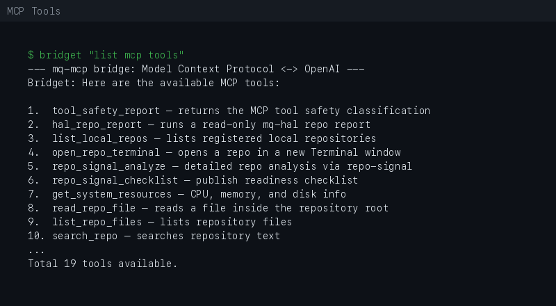
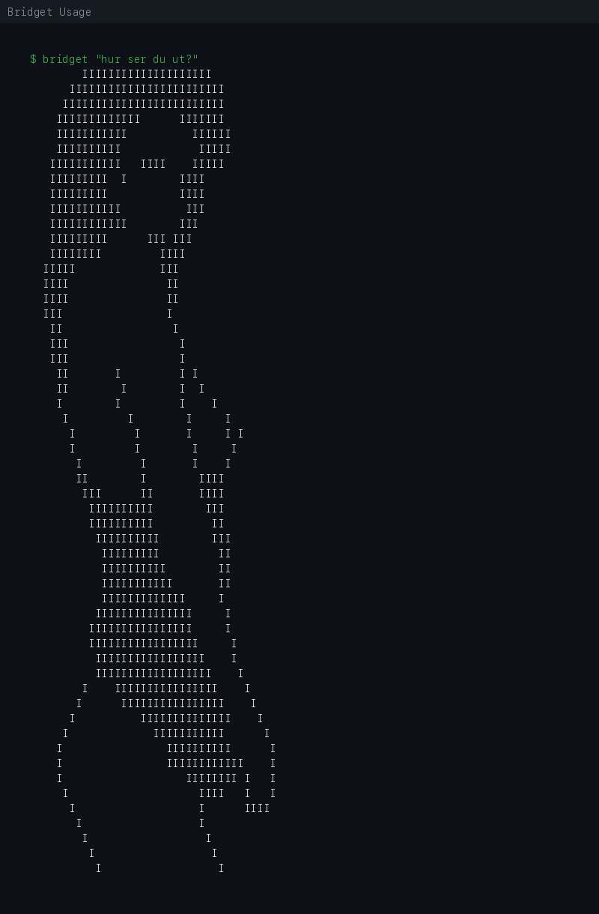

# mq-mcp Demo

Small local examples of mq-mcp in action. Run all commands from the repository root.

## List available tools

```bash
uv --directory mq-mcp run python bridge.py "List the available MCP tools."
```



Expected output (abbreviated):

```text
--- mq-mcp bridge: Model Context Protocol <-> OpenAI ---
Model: gpt-4.1
Prompt: List the available MCP tools.

👩 Bridget: Here are the available MCP tools:

1.  tool_safety_report — returns the MCP tool safety classification
2.  hal_repo_report — read-only mq-hal repo report (audit, brief, release-brief, repo-status, ci)
3.  list_local_repos — lists registered local repositories from MQ_MCP_LOCAL_REPOS
4.  open_repo_terminal — opens a registered local repository in a new Terminal window
5.  repo_signal_analyze — runs repo-signal analyze on a local repository (read-only)
6.  repo_signal_checklist — runs repo-signal publish checklist on a local repository (read-only)
7.  get_system_resources — CPU, memory, and disk info
8.  read_repo_file — reads a file inside the repository root
9.  list_repo_files — lists repository files up to a chosen depth
10. search_repo — searches repository text with git grep
11. git_status — shows branch, status, and recent commits
12. git_diff — shows current git diff
13. validate_project — runs scripts/validate.sh
14. update_repo_file — safely replaces exact text in allowed repo files
15. run_mqlaunch — runs mqlaunch.sh
16. analyze_csv — analyzes CSV files
17. analyze_guitar_pro — analyzes Guitar Pro files
18. open_in_app — opens a file in its default app
19. edit_image — edits an image (resize, rotate, grayscale)
```

## Interactive session (`--chat`)

One-shot is the default. For a multi-turn conversation that keeps context
between turns, use `--chat`:

```bash
uv --directory mq-mcp run python bridge.py --chat
```

```text
Bridget REPL — skriv 'exit', 'quit', 'q' eller Ctrl-D för att avsluta.

👹 master: which tools can read git state?
👩 Bridget: git_status and git_diff …

👹 master: use git_status here
👩 Bridget: …

👹 master: exit
Hej då.
```

Notes:

* One MCP session and one system message stay alive for the whole session;
  tools are discovered once at start.
* Context is bounded automatically for long sessions (oldest turns are trimmed;
  the system prompt is always kept). Override the budget with
  `BRIDGET_CONTEXT_BUDGET`.
* The session is recorded once at exit, not per turn. `bridget --history` tags
  it with its turn count and `bridget --continue` shows its summary.
* An initial prompt is optional: `bridget --chat "start here"` runs that first
  turn, then drops into the prompt.
* Piped input works for scripting: `printf 'list tools\nexit\n' | bridget --chat`.

`--chat` is not the default and does not own workflow orchestration — it only
holds conversational context. Planning, routing, and retries remain `mq-agent`'s
job (see [orchestration-boundary.md](orchestration-boundary.md)).

## Bridget Identity

Bridget has local image identity prompts that render a random JPG when available.

```bash
uv --directory mq-mcp run python bridge.py "hur ser du ut?"
```



## Check system resources

```bash
uv --directory mq-mcp run python bridge.py "Check local system resources."
```

## Read repository context

```bash
uv --directory mq-mcp run python bridge.py "Read README.md and summarize the project."
```

## Check git state

```bash
uv --directory mq-mcp run python bridge.py "Show git status and recent commits."
```

## Run validation

```bash
uv --directory mq-mcp run python bridge.py "Run project validation."
```

Or directly:

```bash
./scripts/validate.sh
```

Expected output:

```text
[OK] server.py
[OK] bridge.py
[OK] main.py
[OK] pyproject.toml
[OK] .env.example
[OK] MCP tool listing works
[OK] read_repo_file tool present
[OK] list_repo_files tool present
[OK] search_repo tool present
[OK] git_status tool present
[OK] git_diff tool present
[OK] validate_project tool present
[OK] update_repo_file tool present
All checks passed.
```

## Bridget safety map demo

Use Bridget to inspect the MCP tool safety classification through the read-only `tool_safety_report` tool.

### Ask for the safety map

```bash
uv --directory mq-mcp run python bridge.py "Use tool_safety_report and summarize the MCP tool safety map."
```

Expected behavior:

* Bridget reads `docs/TOOL_SAFETY.md` through `tool_safety_report`.
* The response summarizes tool scope, access type, and risk level.
* No files are modified. No external paths are accessed.

### Targeted safety questions

```bash
uv --directory mq-mcp run python bridge.py "Which MCP tools are read-only?"
uv --directory mq-mcp run python bridge.py "Which MCP tools can write files?"
uv --directory mq-mcp run python bridge.py "Which MCP tools run subprocesses?"
uv --directory mq-mcp run python bridge.py "Which MCP tools can access explicitly allowed local paths?"
```

Expected behavior:

* Read-only tools (Class A/B) are identified separately from write-capable tools (Class C).
* Subprocess tools (Class D) are called out clearly.
* Tools using `MQ_MCP_ALLOWED_PATHS` are identified as allowlist-scoped.

### Safety rule

`tool_safety_report` is intentionally read-only. It only returns the repository safety documentation. It does not run commands, modify files, or access external paths.

## Bridget + mq-hal + repo-signal

This connects the full local chain:

```text
mq-mcp → mq-hal → repo-signal
```

### Publish-quality audit

```bash
uv --directory mq-mcp run python bridge.py "Use hal_repo_report with mode audit for repo mq-mcp."
```

Bridget calls `hal_repo_report`, which delegates to `mq-hal audit --repo mq-mcp`. mq-hal runs repo-signal locally and returns a publish-quality report. No files are modified.

### Release readiness

```bash
uv --directory mq-mcp run python bridge.py "Use hal_repo_report with mode release-brief for repo mq-mcp."
```

### Other modes

```bash
uv --directory mq-mcp run python bridge.py "Use hal_repo_report with mode brief for repo mq-mcp."
uv --directory mq-mcp run python bridge.py "Use hal_repo_report with mode repo-status for repo mq-mcp."
uv --directory mq-mcp run python bridge.py "Use hal_repo_report with mode ci for repo mq-mcp."
```

`hal_repo_report` is read-only. It runs mq-hal as a local subprocess but cannot write files or run arbitrary commands.

## Notes

This project is local-first and experimental. Review every tool before connecting it to private folders, credentials, or write-capable workflows. See [security.md](security.md) for the full safety policy.
