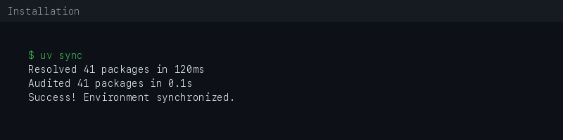

# Installation Guide

This guide explains how to install and validate `mq-mcp` locally on macOS.

## Requirements

- macOS
- Git
- Python >=3.11 (managed automatically by `uv`)
- [uv](https://docs.astral.sh/uv/)
- OpenAI API key (only needed for bridge prompts that call OpenAI)

## Standard Install

```bash
git clone https://github.com/MCamner/mq-mcp.git
cd mq-mcp
./scripts/install.sh
```

The installer:

- creates `mq-mcp/.env` from `.env.example` when missing
- runs `uv sync`
- installs the local `mq-mcp` command with `uv tool install`
- runs `mq-mcp doctor`

## Local Commands

After install, use the command surface from any terminal:

```bash
mq-mcp doctor
mq-mcp health
mq-mcp tools
mq-mcp serve
mq-mcp validate
mq-mcp config path
mq-mcp report --json
mq-mcp profiles list
```



## Run Without Installing the Command

You can also run directly from the Python project folder:

```bash
cd mq-mcp
uv run python bridge.py --tools
uv run mcp run server.py
```

## Environment

The installer creates `mq-mcp/.env` if it does not already exist.

Edit it before using bridge prompts that need an API key:

```bash
OPENAI_API_KEY=your_api_key_here
MQ_MCP_ALLOWED_PATHS=""
MQ_MCP_LOCAL_REPOS=""
```

Do not commit real API keys, tokens, private paths, or secrets.

## Upgrade

From the repository root:

```bash
./scripts/upgrade.sh
```

The upgrade helper pulls `main`, syncs dependencies, reinstalls the local
command, and runs validation.

## Uninstall

From the repository root:

```bash
./scripts/uninstall.sh
```

This removes the `uv tool` command and keeps your local `.env`.

To remove the local `.env` interactively:

```bash
./scripts/uninstall.sh --remove-env
```

## Clean Reinstall

Use this when dependencies or local tool shims are stale:

```bash
./scripts/uninstall.sh
cd mq-mcp
rm -rf .venv
cd ..
./scripts/install.sh
mq-mcp validate
```

## Optional Zsh Completion

```bash
mkdir -p ~/.zsh/completions
ln -sf "$(pwd)/completions/_mq-mcp" ~/.zsh/completions/_mq-mcp
```

Make sure `~/.zsh/completions` is in your `fpath`.

## Background Service Mode

`mq-mcp` does not install a daemon or autostart service by default. MCP clients
usually start the server as a local process. If you later add an explicit
LaunchAgent, keep it user-owned, disabled by default, and pointed at
`mq-mcp serve`.

## Observability

When the server is running, local HTTP/SSE transports expose:

```text
/health
/tool-count
/server-info
/diagnostics
```

The CLI also works without a running server:

```bash
mq-mcp health
mq-mcp info --json
mq-mcp report --json
mq-mcp bundle --validate
```

Diagnostics redact secret-like environment variables such as API keys.

## Profiles

Profile templates live in `profiles/` and cover common clients and workflows:

```bash
mq-mcp profiles list
mq-mcp profiles show read-only
mq-mcp profiles show claude-desktop
mq-mcp profiles validate
```

See [`profiles.md`](profiles.md) for when to use each profile and which
placeholders to replace locally.

## Notes

This is a local-first experimental MCP project. Review exposed tools before extending file access or write capabilities.
